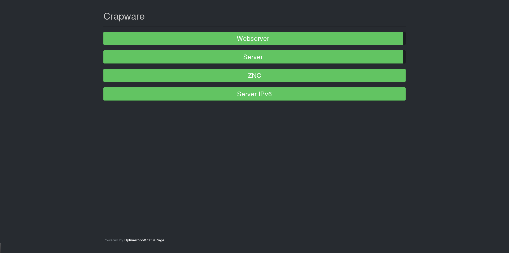

# UptimerobotStatusPage
A simple Status Page for [Uptimerobot](https://uptimerobot.com)

# Config
### [HTML]
| Key | Description |
|-----|-------------|
|title| Used in title-attr and header|
### [Robot]
| Key | Description |
|-----|-------------|
|api_key| API-Key of your UptimeRobot-Account|
## Example
```
[HTML]
title = MySite
[Robot]
api_key = uptimerobot-api-key
```
# Screenshot

